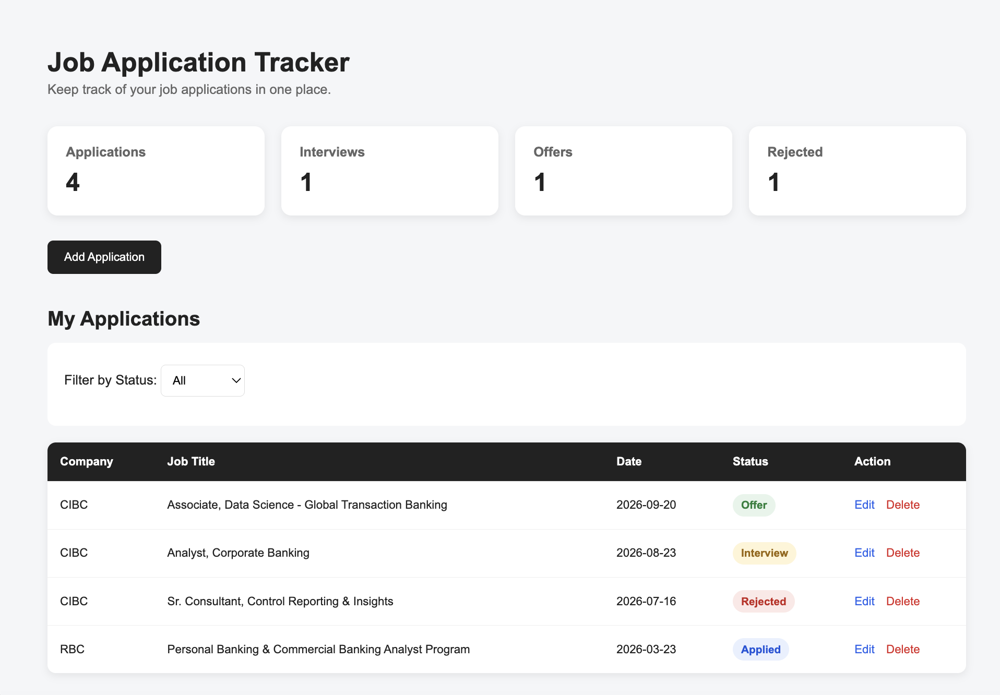
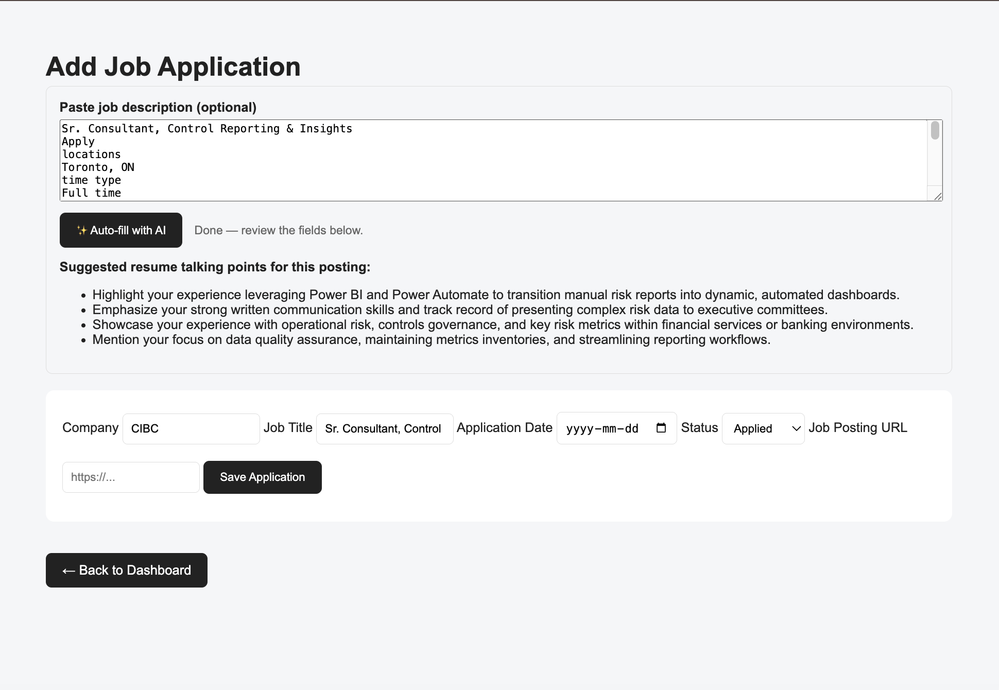

# Job Application Tracker

## Screenshots

### Dashboard



### AI-Powered Application Entry



A full-stack web application for tracking job applications, interviews, offers, and rejections — with an AI feature that auto-fills applications from a pasted job posting and suggests tailored resume talking points.

**🔗 Live demo:** [job-application-tracker-otge.onrender.com](https://job-application-tracker-otge.onrender.com)

## Features

* Add, edit, and delete job applications
* **AI auto-fill** — paste a job posting and Google Gemini extracts the company/title and suggests resume talking points tailored to that posting
* Filter applications by status
* Sort applications by date
* Track application statistics (total, interviews, offers, rejections)
* REST API for creating, viewing, updating, and deleting applications
* Containerized with Docker and backed by a real Postgres database
* Continuous integration via GitHub Actions on every push

## Technologies

* Python / Flask
* PostgreSQL (via [Neon](https://neon.tech))
* Google Gemini API
* Docker / Docker Compose
* GitHub Actions (CI)
* HTML / CSS
* REST API
* Git/GitHub
* Deployed on Render

## API Endpoints

| Method | Endpoint                 | Description              |
| ------ | ------------------------ | ------------------------ |
| GET    | `/api/applications`      | Get all applications     |
| POST   | `/api/applications`      | Create a new application |
| PUT    | `/api/applications/<id>` | Update an application    |
| DELETE | `/api/applications/<id>` | Delete an application    |
| POST   | `/api/parse-job`         | Parse a pasted job posting via Gemini and return company, job title, and suggested resume talking points |


## How to Run Locally

This project runs via Docker, which handles the Python environment and a local Postgres database for you.

### 1. Clone the repository

```bash
git clone https://github.com/scarelet/job-application-tracker.git
cd jobtracker
```

### 2. Set up environment variables

Copy the example file and fill in your own values:

```bash
cp .env.example .env
```

Edit `.env` and add:
* `GEMINI_API_KEY` — get a free key at [aistudio.google.com/apikey](https://aistudio.google.com/apikey)
* `GEMINI_MODEL` — defaults to `gemini-3.6-flash`
* `DATABASE_URL` — already set correctly for local Docker use, no changes needed

### 3. Build and run with Docker

```bash
docker compose up --build
```

This starts both the Flask app and a local Postgres database together.

### 4. Open the app

Go to:

```
http://localhost:8000
```

## Deployment

This app is deployed on [Render](https://render.com) (free tier, Docker runtime) with a [Neon](https://neon.tech) Postgres database (free tier). Environment variables (`DATABASE_URL`, `GEMINI_API_KEY`, `GEMINI_MODEL`) are configured directly in the Render dashboard.

## Continuous Integration

Every push to `main` triggers a GitHub Actions workflow (`.github/workflows/ci.yml`) that:
* Installs dependencies and verifies the app imports cleanly against a temporary Postgres instance
* Builds the Docker image

See the [Actions tab](https://github.com/scarelet/job-application-tracker/actions) for build status.
